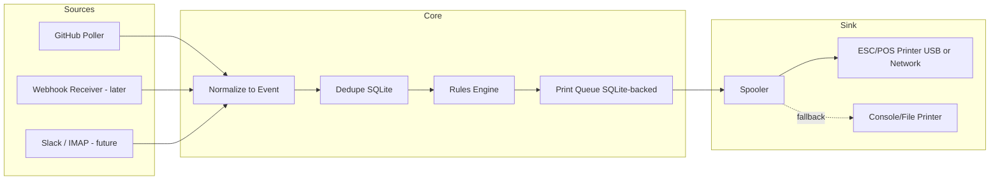

# Architecture — hardcopy

A small service that turns notifications into physical receipts. GitHub first; Slack/Email later without touching the core.

## Design principles

1. **Sources are plugins.** Everything entering the system is converted to one normalized `Event`. Adding Slack later = one new source class, zero core changes.
2. **Pull first, push-ready.** Polling the GitHub Notifications API needs no inbound access to your network. The ingest layer is shaped so a webhook receiver slots in later as just another source.
3. **The printer is a sink behind a queue.** Printer offline ≠ lost notification. Events persist in SQLite until printed.
4. **One process, asyncio.** This is a single-user service printing a few receipts a day. No brokers, no microservices.

## Data flow



## Components

### Event (models.py)
The single contract between sources and core:

```python
Event(id, source, kind, title, repo, actor, url, body, priority, created_at)
```

`id` is source-scoped and stable (e.g. `github:thread:12345`) — the dedupe key.

### Sources (sources/)
`Source` base class: `async def events() -> AsyncIterator[Event]`.

- **GitHubPoller** (v1): `GET /notifications` with a PAT. Honors `X-Poll-Interval` and `If-Modified-Since` (304 = free, no rate cost). Maps notification `reason` → `Event.kind`: `review_requested`, `mention`, `assign`, `ci_activity`, etc.
- **WebhookSource** (later): FastAPI endpoint + HMAC verification, exposed via Tailscale Funnel or Cloudflare Tunnel. Same `Event` out.
- **Future**: SlackSource (Socket Mode — also no inbound port needed), ImapSource.

### Rules engine (rules.py)
Ordered YAML rules; first match wins. Match on `source`, `kind`, `repo` (glob); action `print` or `drop`, plus `priority`. Unmatched events drop — the printer only speaks when spoken about.

```yaml
rules:
  - match: {source: github, kind: review_requested}
    action: print
    priority: high
  - match: {source: github, kind: mention, repo: "org/*"}
    action: print
  - match: {}
    action: drop
```

Quiet hours: events matched during e.g. 22:00–08:00 stay queued and print as a morning batch.

### Store (store.py)
One SQLite file (WAL mode): `seen` (dedupe ids), `queue` (pending prints, survives restarts), `cursor` (poll state). No external DB.

### Spooler + Renderer (spooler.py, render.py)
Spooler drains the queue with exponential backoff when the printer errors. Renderer produces the receipt: header with source + kind, title (wrapped to paper width: 32 chars @ 58 mm, 42–48 @ 80 mm), repo/actor line, QR code of the URL (scan → open PR on your phone), timestamp, cut.

### Printers (printers/)
`Printer` base class: `def print(receipt: Receipt)`.

- **EscposPrinter** — python-escpos; config picks `usb:` (vendor/product id) or `network:` (host:9100). Both your interfaces, one class.
- **ConsolePrinter** — renders to stdout/file. Dev mode and fallback.

## Deployment (Docker Compose)

- **Network printer (recommended for cluster)**: container runs on any node, talks to printer over TCP 9100. No device mapping.
- **USB printer**: container pinned to the node the printer is plugged into; `devices: ["/dev/bus/usb"]` + host udev rule for permissions.
- Secrets (`GITHUB_TOKEN`) via `.env`; config via mounted `config.yaml`; SQLite on a named volume; `restart: unless-stopped`; healthcheck hits an internal `/healthz`.

## Extensibility contract

To add a notification source: implement `Source`, emit `Event`s, register it in config. Nothing else changes — rules, queue, rendering, printing all operate on `Event`.
